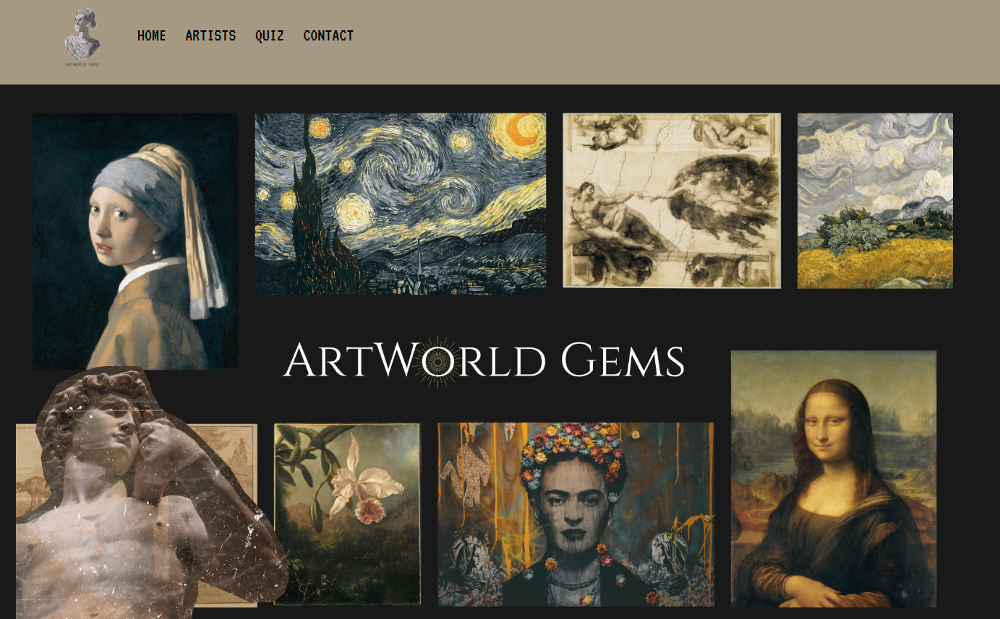
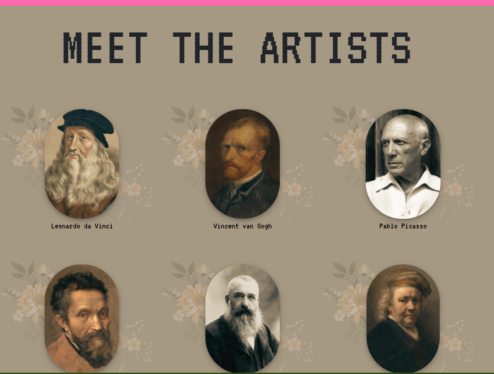

# ArtWorld-Gems

**ArtWorld-Gems** is an interactive web platform that showcases a collection of famous artists and their paintings. Explore the art world by navigating through artist galleries, quizzes, and more!

## Features:
- **Home Page**: Welcome page with easy navigation to artists, quizzes, and contact information.
- **Artists Gallery**: Browse through a list of famous artists, such as Leonardo da Vinci, Frida Kahlo, and Pablo Picasso. Clicking on an artist takes you to their individual page, where you can view their paintings.
- **Quiz Section**: Engage with quizzes to test your knowledge of art history and famous artists.
- **Contact Page**: Subscribe to the newsletter and get in touch with us via email and phone number for any inquiries.

## Technologies Used:
- **HTML/CSS**: For creating the structure and styling of the website.
- **PHP**: For backend processing, such as form submissions and dynamic content handling.
- **JavaScript**: For interactive elements like navigation and quizzes.
- **Bootstrap**: For responsive design that adapts to various screen sizes.

